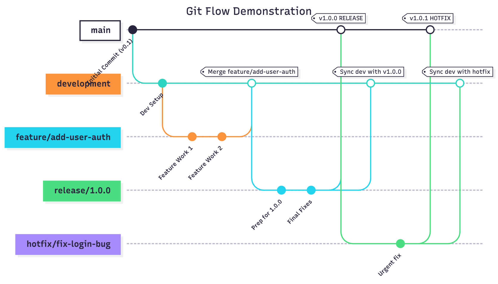

# Erasmus in Porto

This project is designed to facilitate the Erasmus experience in Porto, providing a platform for students to connect and participate in events.

# Repository Structure

```
E
├── .github/       # GitHub Actions workflows
├── .husky/        # Pre-commit hooks
├── backend/       # Django backend
│   └── README.md       # Backend-specific documentation
├── frontend/      # Next.js frontend
│   └── README.md       # Frontend-specific documentation
├── README.md      # Project documentation (you are here)
└── setup.sh       # Setup script for Unix-based systems
└── setup.ps1      # Setup script for Windows PowerShell
```

```
deployment/
└── README.md      # Deployment-specific documentation
├── staging/       # Build output for the staging environment
└── production/    # Build output for the production environment
```

> **Note**: [`deployment`](https://github.com/MESW-LES-2025/E/tree/deployment) branch is a separate branch used for managing application builds and deployment.

# Quick Setup

To set up the development environment quickly, run the provided setup script appropriate for your operating system:

- For Windows (PowerShell): [`\setup.ps1`](./setup.ps1)
- For Unix-based systems (Bash): [`./setup.sh`](./setup.sh)

This script should **only be run the first time** you set up the project.

# Git Flow Branching Model

This project follows the **Git Flow workflow**, a structured branching model to manage development, releases, and hotfixes efficiently.

**Main branches**

- **main** → production-ready code; every commit here represents a release.
- **development** → integration branch for new features; serves as the base for upcoming releases.

**Supporting branches**

- **Feature/Task branches** → for developing new features/tasks. Branch off from `development` and merge back when complete.

- **Release branches** → for preparing a new version. Branch off from `development`, allow final tweaks/bug fixes, and merge into both `main` and `development`.

- **Hotfix branches** → for urgent fixes in production. Branch off from `main` and merge into both `main` and `development`.

Below is a visual representation of the Git Flow branching model:



To maintain traceability and clarity, always use **descriptive names** for branches and **link to the related issue**.

# Pre-commit Hooks

Pre-commit hooks are used in this project to ensure code quality and consistency before changes are committed to the repository.

Although hooks are useful for maintaining code standards, it's important to understand that you may be required to address issues they raise before being allowed to commit your changes.

Hooks can be bypassed if absolutely necessary using:

```bash
git commit --no-verify
```

This project uses the following hooks:

- **Frontend**: Linting and formatting are handled using `eslint` and `prettier`. These are configured to run automatically on staged files via `lint-staged`.
- **Backend**: Python code is checked using `black`, `isort`, `flake8`, and `mypy` through `pre-commit`.

Once installed during [`Quick Setup`](#quick-setup), the hooks will automatically run before each commit for each staged file. If any issues are detected, the commit will be blocked until they are resolved.

Learn more about [git hooks.](https://git-scm.com/book/ms/v2/Customizing-Git-Git-Hooks)

# Continuous Integration (CI)

This project uses [GitHub Actions](https://docs.github.com/en/actions) for Continuous Integration (CI). The workflows are defined in the [`.github/workflows/`](./.github/workflows) directory and are triggered by updates to the `main` or `development` branches, or by creating or updating pull requests.

## Backend Workflow

The backend workflow ensures code quality and functionality for the Django backend. It performs the following tasks:

- Checks code formatting (`black`);
- Checks import sorting (`isort`);
- Checks linting compliance (`flake8`);
- Checks type checking (`mypy`);
- Executes tests (`pytest`), ensuring a minimum level of code coverage.

## Frontend Workflow

The frontend workflow validates and deploys the Next.js application. It includes:

- Checks code formatting (`prettier`);
- Checks linting compliance (`eslint`);
- Executes testing (`jest`), ensuring a minimum level of code coverage;

For more details, refer to the workflow files in the [`.github/workflows/`](./.github/workflows) directory.

```
.github/
└── workflows/
    ├── backend-workflow.yml
    └── frontend-workflow.yml
```

# Continuous Deployment (CD)

This project uses [GitHub Pages](https://pages.github.com/) to serve the application directly from the [`deployment`](https://github.com/MESW-LES-2025/E/tree/deployment) branch. The deployment process is automated and is triggered by commits to the `main` or `development` branches.

The application can be accessed at:

- Staging: [https://mesw-les-2025.github.io/E/staging/](https://mesw-les-2025.github.io/E/staging/)
- Production: [https://mesw-les-2025.github.io/E/production/](https://mesw-les-2025.github.io/E/production/)

## Environment Usage

We should use different environments for staging and production to ensure that testing and development do not interfere with the live application.

- **Staging Environment**:

  - Used for testing new features and changes before they are released to production.
  - Reflects the state of the `development` branch.
  - Allows developers and testers to validate functionality in an environment similar to production.

- **Production Environment**:
  - The live environment accessible to end-users.
  - Reflects the state of the `main` branch.
  - Only stable and tested features (or hotfixes) should be deployed here.

For more details, refer to README file available at the [`deployment`](https://github.com/MESW-LES-2025/E/tree/deployment) branch.

# Frameworks and Tools

- Django - A high-level Python web framework. [See Django docs](https://docs.djangoproject.com/en/5.2).
- Next.js - A React-based framework for building web applications. [See Next.js docs](https://nextjs.org/docs).
